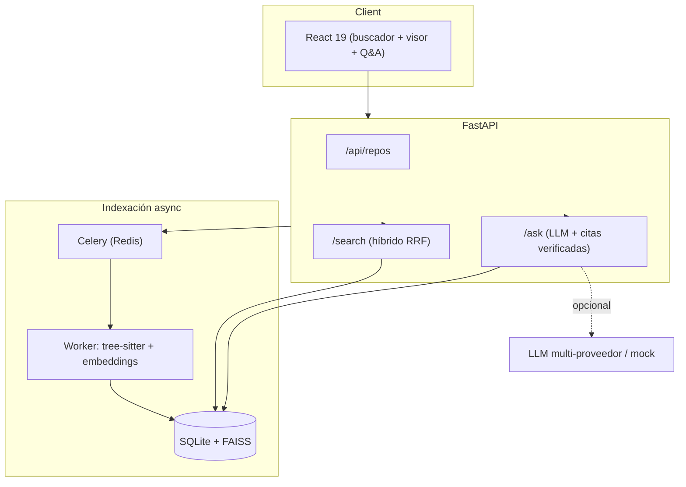

# RepoBrain

[](https://github.com/LuisFloresA/RepoBrain/actions/workflows/ci.yml)

**Grep en lenguaje natural.** Pegas un repositorio, RepoBrain lo indexa
(`tree-sitter` + *embeddings* + BM25) y respondes a preguntas como
*"¿dónde se valida el JWT?"* con respuestas que citan `archivo:línea`.

> Proyecto de portafolio, gemelo de TechDebt Radar. Implementado por fases.

## Qué resuelve

`grep` busca cadenas exactas; RepoBrain busca **intención**. "¿cómo se hace el
soft delete?" no aparece literal en el código, pero sí `def soft_delete(self)`
— el ranking híbrido lo encuentra y, con el Q&A, te lo explica citando la línea
exacta. Todo sin API key, sin registro y sin red para el demo embebido.

## Quickstart

```bash
docker compose up --build
```

- Frontend: http://localhost:5174
- Backend API: http://localhost:8002
- OpenAPI: http://localhost:8002/docs

Al arrancar se crea el **repo de demo embebido** ("Demo · login-api (JWT)").
Pulsa **"Probar ahora"** y, después, escribe tu propia pregunta en el panel
"Pregunta al código".

### LLM real (opcional)

Sin `LLM_API_KEY` el Q&A usa un **mock anti-bloqueo** (mismo pipeline, sin
coste). Para un proveedor real:

```bash
LLM_PROVIDER=deepseek LLM_API_KEY=... docker compose up -d --build
```

Proveedores soportados: `openai`, `deepseek`, `gemini`, `ollama` (protocolo
`/chat/completions`).

## Producción (Docker + Cloudflare Tunnel)

Stack autocontenido que **no expone puertos** al host y soporta
**repos privados** (deploy key SSH):

```bash
git clone https://github.com/LuisFloresA/RepoBrain.git && cd RepoBrain
cp .env.prod.example .env.prod          # opcional: LLM real
docker compose -f docker-compose.prod.yml up -d --build
docker compose -f docker-compose.prod.yml logs -f tunnel   # → URL https://XXX.trycloudflare.com
```

## Arquitectura



Detalle y ADRs en [`docs/arquitectura.md`](docs/arquitectura.md).

## Endpoints (resumen)

| Método | Ruta | Descripción |
|---|---|---|
| POST | `/api/repos` | Crear repo (`url`+opcional `branch`, o `source=demo`) y encolar indexación |
| GET | `/api/repos/{id}/status` | Progreso de indexación + métricas de cobertura |
| GET | `/api/repos/{id}/search?q=` | Búsqueda híbrida con citas `path:línea` |
| POST | `/api/repos/{id}/ask` | Q&A con LLM y citas **verificadas** |
| GET | `/api/repos/{id}/files/{path}` | Contenido de un archivo (visor) |
| GET | `/api/repos/{id}/architecture` | Mapa de arquitectura (nodos/edges + Mermaid + Markdown) |

Toda la API en [`docs/api.md`](docs/api.md).

## Tests

```bash
# Backend (pytest + coverage ≥85%)
cd backend
python -m venv .venv && .\.venv\Scripts\pip install -e ".[dev]"
.\.venv\Scripts\python -m pytest
.\.venv\Scripts\python -m ruff check app tests workers

# Frontend (Vitest + RTL + tsc/eslint)
cd frontend
npm ci
npm run lint
npm run test -- --run
npm run build
```

## Fases

| Fase | Entregable | Estado |
|------|-----------|--------|
| F0 | Esqueleto (compose, health) | ✅ |
| F1 | Index + búsqueda híbrida + visor | ✅ |
| F2 | Q&A con LLM y citas validadas | ✅ |
| F3 | Pulido: docs, hardening (rate limit, secretos), CI | ✅ |
| F4 | Responsividad, ramas, Java/C#, indexación incremental, métricas, mapa de arquitectura | ✅ |
| F5 | Producción vía Docker + Cloudflare Tunnel | ✅ |

## Seguridad

El código de un repo **nunca se ejecuta** (solo parseo estático), se bloquea
**SSRF** (IPs privadas/metadatos al clonar), **path traversal**, **rate
limiting** por IP en `/api/*`, y los contenedores corren como **usuario
no-root**. El visor **enmascara secretos** (`sk-…`, `AKIA…`, `password=…`).
Detalle en [`docs/seguridad.md`](docs/seguridad.md).

## Documentación

- [`docs/DOCUMENTACION.md`](docs/DOCUMENTACION.md) — documentación técnica
  completa y consolidada (tecnologías, arquitectura, modelo de datos, API,
  seguridad, despliegue y ADRs).
- [`docs/arquitectura.md`](docs/arquitectura.md) — componentes y ADRs.
- [`docs/api.md`](docs/api.md) — endpoints con ejemplos curl.
- [`docs/demo.md`](docs/demo.md) — guión de demo de 2 minutos.
- [`docs/seguridad.md`](docs/seguridad.md) — matriz de amenazas.

## Licencia

MIT.
