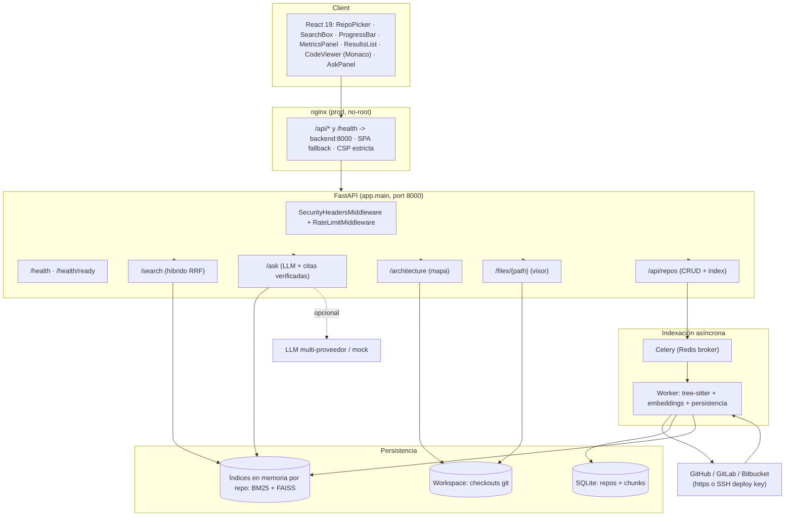

# RepoBrain — Documentación técnica completa

> **Resumen en una línea:** RepoBrain es un buscador tipo *"grep en lenguaje
> natural"* y un asistente de Q&A sobre repositorios de código. Pegas una URL
> (o usas la demo embebida), el motor clona e indexa el código con
> `tree-sitter` + *embeddings* + BM25, y luego puedes buscar por intención o
> preguntarle al código, recibiendo respuestas con **citas verificadas**
> `archivo:línea`.

Documento consolidado de referencia: arquitectura, tecnologías, implementación,
modelo de datos, API, seguridad, despliegue, pruebas y decisiones de diseño.

---

## Índice

1. [Visión general](#1-visión-general)
2. [Tecnologías](#2-tecnologías)
3. [Arquitectura](#3-arquitectura)
4. [Estructura del repositorio](#4-estructura-del-repositorio)
5. [Modelo de datos](#5-modelo-de-datos)
6. [Pipeline de indexación](#6-pipeline-de-indexación)
7. [Motor de búsqueda híbrido](#7-motor-de-búsqueda-híbrido)
8. [Q&A con LLM y citas verificadas](#8-qa-con-llm-y-citas-verificadas)
9. [Mapa de arquitectura](#9-mapa-de-arquitectura)
10. [API REST](#10-api-rest)
11. [Frontend](#11-frontend)
12. [Seguridad](#12-seguridad)
13. [Configuración por entorno](#13-configuración-por-entorno)
14. [Despliegue](#14-despliegue)
15. [Pruebas y calidad](#15-pruebas-y-calidad)
16. [Decisiones de diseño (ADRs)](#16-decisiones-de-diseño-adrs)
17. [Fases del proyecto](#17-fases-del-proyecto)
18. [Operación en producción](#18-operación-en-producción)
19. [Evolución propuesta](#19-evolución-propuesta)

---

## 1. Visión general

```
grep busca cadenas exactas; RepoBrain busca intención.
```

- `grep` no responde a *"¿cómo se hace el soft delete?"* si el código dice
  `def soft_delete(self)`. RepoBrain sí: el **ranking híbrido** (léxico +
  semántico) encuentra el fragmento y el **Q&A** explica la respuesta citando la
  línea exacta.
- Funciona **sin API key, sin registro y sin red** para el repo de demo
  (embebido y pre-indexado dentro de la imagen).
- Está preparado para producción como stack Docker autocontenido, expuesto
  públicamente a través de **Cloudflare Quick Tunnel** (sin abrir puertos en el host).

### Características clave

| Capacidad | Cómo se logra |
|---|---|
| Indexación de repos públicos y **privados** | `git clone` seguro (SSRF check) + deploy key SSH a github/gitlab/bitbucket |
| Lenguajes soportados | Python, JavaScript, TypeScript, Java, C# (5 gramáticas tree-sitter) |
| Búsqueda por intención | Fusión **RRF** de BM25 (léxico) + coseno sobre embeddings (semántico) |
| Preguntas al código | LLM multi-proveedor (`openai`, `deepseek`, `gemini`, `ollama`) + **mock anti-bloqueo** |
| Citas que no alucinan | Cada cita `path:línea` se **valida contra el checkout real** |
| Progreso en vivo | Indexación asíncrona con **Celery + Redis**, *polling* desde la UI |
| Actualización de un repo ya indexado | Sincronización incremental con `git diff` (solo re-indexa los archivos cambiados) |
| Ramas distintas de `main` | `git clone --single-branch --branch <rama>` |
| Métricas de cobertura | `stats`, `indexed_files`, `skipped_files`, `indexed_bytes`, `source_rev` |
| Mapa de arquitectura | Nodos/edges (Mermaid + Markdown) generados con tree-sitter |
| Demo autocontenida | Repo "Demo · login-api (JWT)" embebido y pre-indexado en el arranque |

---

## 2. Tecnologías

### Backend (`backend/`)

| Área | Tecnología | Mitad del detalle |
|---|---|---|
| Web API | **FastAPI ≥0.115** (Pydantic v2, ASGI) | app `0.2.0`, docs `/docs` y `/redoc` |
| Serialización | **Pydantic v2 + pydantic-settings** | DTOs y configuración por entorno |
| Base de datos | **SQLAlchemy 2.x + SQLite** | Modelos `Repo` y `Chunk`; sin migraciones externas |
| Cola de tareas | **Celery ≥5.4 + Redis ≥5.2** | Broker + *result backend* en Redis (`:6379/0`) |
| Parseo de código | **tree-sitter ≥0.24** + gramáticas `python`, `javascript`, `typescript`, `java`, `c-sharp` | Solo AST estático, nunca se ejecuta |
| Búsqueda léxica | **bm25s ≥0.3** | Índice BM25 en memoria por repo (K1=1.5, B=0.75) |
| Search vectorial | **FAISS** (`IndexFlatIP`) con fallback a NumPy | Coseno sobre vectores normalizados, dim **384** |
| Embeddings | **sentence-transformers ≥3.3** → `all-MiniLM-L6-v2` | Batch 64, lazy-load en el worker |
| Embedder de emergencia | `HashEmbedder` (determinista, sin modelo) | Modo `EMBEDDER_BACKEND=hash` |
| Cliente LLM | stdlib `urllib` (sin deps de red) | Protocolo OpenAI `/chat/completions` |
| Tests | **pytest + pytest-asyncio + pytest-cov + httpx** | 89 tests, cobertura ≥85 % |
| Lint | **ruff** (`E,F,I,B,UP`, line-length 100) | CI exige `ruff check app tests workers` |
| Runtime | **CPython 3.12** (CI) / **3.13-slim** (prod) / **3.14-slim** (dev) | usuario no-root `appuser` (uid 10001) |

### Frontend (`frontend/`)

| Área | Tecnología | Detalle |
|---|---|---|
| UI | **React 19** (funcional + hooks) | SPA monolítica |
| Build | **Vite 6** + **TypeScript ~5.7** | `manualChunks` separando `monaco` y `react` |
| Editor de código | **Monaco Editor** (`@monaco-editor/react` 4.7) | Paquete npm local (sin CDN) → funciona offline |
| Estilos | CSS propio (`index.css`) | Tema oscuro, sin framework CSS |
| Tests | **Vitest + Testing Library + jsdom** | Componentes y flujos |
| Lint/typecheck | **ESLint 9 + typescript-eslint + tsc** | `npm run lint` |
| Servidor prod | **nginx 1.27-alpine** no-root | propio `nginx.conf` + `nginx-main.conf` |
| Node | `node:24-alpine` (dev, `npm run dev`) | hot-reload |

### Infraestructura / Despliegue

| Pieza | Tecnología |
|---|---|
| Orquestación | Docker Compose v2 (dev + prod), nombrado `repobrain` / `repobrain-prod` |
| Redis | `redis:7-alpine` (sin puerto expuesto al host) |
| Base prod | `python:3.13-slim` (multi-stage, demo horneada) |
| Frontend prod | `nginx:1.27-alpine` multi-stage |
| Exposición pública | **cloudflare/cloudflared** (Quick Tunnel) → `https://XXX.trycloudflare.com` |
| CI | GitHub Actions (`ubuntu-latest`): backend (ruff+pytest+cov), frontend (lint+test+build), docker build |
| Servidor / VM | Linux (ARM64 / x86_64, Ubuntu 24.04), Docker + Compose; persistencia en `/opt/repobrain` |

---

## 3. Arquitectura

### Vista de componentes



### Flujo de datos end-to-end

1. **Registro**: `POST /api/repos` recibe `url` (+ `branch` opcional) o
   `source=demo`. El `Repo` se crea en estado `indexing` y se encola la tarea
   `index_repo` en Celery. (`` `_enqueue_index` ``)
2. **Operación remota** (en el worker):
   - `source=url` y sin checkout → `clone_public_repo` (clone `--depth 1
     --no-hardlinks --single-branch [--branch R]`).
   - `source=url` y con checkout → `sync_checkout` (fetch incremental + `git
     diff`) y re-indexa **solo los archivos cambiados** (≤200) o todo si superó
     el umbral.
   - `source=demo` → usa `demo/data` embebido.
3. **Indexación**: `index_directory` lista archivos, los parsea con
   tree-sitter (extrae *anchors*), los trocea en chunks de ~512 tokens y calcula
   las estadísticas de cobertura.
4. **Embeddings + persistencia**: por lotes de `EMBED_BATCH_SIZE`, se generan
   los vectores y se insertan los `Chunk` en SQLite. Se reindexa el dato y se
   invalida la caché de búsqueda del repo.
5. **Búsqueda**: `GET /api/repos/{id}/search?q=` construye (y cachea) BM25 +
   FAISS por `(repo_id, chunk_count)`, fusiona ambos rankings con RRF y devuelve
   resultados con cita `path:línea` + desglose de scores.
6. **Q&A**: `POST /api/repos/{id}/ask` recupera los top-K chunks, monta el
   contexto, llama al LLM (o al mock sin API key) y **valida cada cita contra el
   checkout real** (existe el archivo y la línea cabe).
7. **Vista**: `GET /api/repos/{id}/files/{path}` devuelve contenido (con límite
   de 2 MB) para el visor de Monaco; `GET /{id}/architecture` devuelve el mapa
   (Mermaid + Markdown descargable).

### Middlewares (orden de aplicación)

`app.main:create_app` registra primero `SecurityHeadersMiddleware` y después
`RateLimitMiddleware`, de modo que **el rate limit queda en la capa más externa**
(`RateLimit` → `SecurityHeaders` → rutas).

---

## 4. Estructura del repositorio

```
RepoBrain/
├── .github/workflows/ci.yml       # CI: ruff + pytest+cov + frontend + docker build
├── docker-compose.yml             # dev: redis + backend(8002) + worker + frontend(5174)
├── docker-compose.prod.yml        # prod: + tunnel cloudflared, sin puertos al host
├── .env.prod.example              # plantilla (LLM real opcional) en la VM
├── .gitattributes                 # *.sh text eol=lf (evita bug nginx por CRLF)
├── README.md
├── docs/
│   ├── DOCUMENTACION.md           # ← este documento
│   ├── arquitectura.md            # componentes + ADRs
│   ├── api.md                     # endpoints con ejemplos curl
│   ├── demo.md                    # guión de demo de 2 min
│   └── seguridad.md               # matriz de amenazas
├── demo/data/                     # demo embebida "login-api" (Python + JS)
│   └── app/{auth,db,models,routes}.py, web/api.js, README.md
├── backend/
│   ├── Dockerfile                 # dev (python:3.14-slim)
│   ├── Dockerfile.prod            # prod (python:3.13-slim, demo horneada)
│   ├── pyproject.toml             # deps, pytest/coverage/ruff config
│   ├── requirements-runtime.txt   # deps de runtime (capa cacheable Docker)
│   ├── app/
│   │   ├── main.py                # fábrica FastAPI + lifespan
│   │   ├── api/
│   │   │   ├── health.py          # /health, /health/ready
│   │   │   ├── repos.py           # CRUD repos, search, ask, files, architecture
│   │   │   └── schemas.py         # DTOs Pydantic
│   │   ├── core/
│   │   │   ├── config.py          # Settings (env / .env)
│   │   │   ├── security.py        # headers, SSRF, path traversal, SSH keys
│   │   │   ├── rate_limit.py      # rate limiting por IP en memoria
│   │   │   └── cli.py             # entrypoint `repobrain` (uvicorn)
│   │   ├── db/
│   │   │   ├── models.py          # Repo, Chunk
│   │   │   └── session.py         # engine, SessionLocal, init_db + migración ligera
│   │   ├── indexing/
│   │   │   ├── indexer.py         # recorre y trocea un directorio
│   │   │   ├── parser.py          # tree-sitter: anchors y symbols por lenguaje
│   │   │   ├── chunker.py         # troceado a chunks ~512 tokens alineados a definiciones
│   │   │   ├── sync.py            # git fetch + diff incremental
│   │   │   └── repo_cloner.py     # clone seguro (SSRF + SSH allowlist)
│   │   ├── architecture/
│   │   │   └── map.py             # mapa de arquitectura (nodes/edges + Mermaid + MD)
│   │   ├── vector/
│   │   │   ├── embeddings.py      # SentenceEmbedder / HashEmbedder
│   │   │   ├── bm25.py            # wrapper bm25s
│   │   │   ├── store.py           # FAISS (o numpy) — coseno
│   │   │   ├── hybrid.py          # fusión RRF
│   │   │   ├── search_service.py  # caché de índices y búsqueda híbrida
│   │   │   └── qa_service.py      # pipeline /ask con citas
│   │   └── llm/
│   │       ├── base.py            # contrato LLMClient + LLMError
│   │       ├── factory.py         # mock | openai | deepseek | gemini | ollama
│   │       ├── openai.py          # cliente /chat/completions (stdlib)
│   │       ├── mock.py            # respuesta plantilla (sin API key)
│   │       └── citations.py       # extracción y validación de citas
│   ├── workers/
│   │   ├── celery_app.py          # Celery app (broker/backend Redis)
│   │   └── tasks.py               # index_repo (+ seed_demo_repo, noop)
│   └── tests/                     # 89 tests (conftest + 10 archivos)
└── frontend/
    ├── Dockerfile                 # build Vite + runtime nginx no-root
    ├── nginx.conf                 # proxy /api→backend:8000, CSP, SPA fallback
    ├── nginx-main.conf            # pid en /tmp (nginx no-root)
    ├── docker-entrypoint.sh       # `exec nginx -g 'daemon off;'`
    ├── package.json / vite.config.ts
    └── src/
        ├── App.tsx                # estado global, polling, orquestador
        ├── main.tsx, index.css
        ├── api/{client,types}.ts  # cliente fetch tipado + tipos de la API
        ├── components/{RepoPicker,SearchBox,ProgressBar,MetricsPanel,
        │              ResultsList,CodeViewer,AskPanel}.tsx
        └── lib/{mask,monaco}.ts   # enmascarado de secretos + Monaco offline
```

---

## 5. Modelo de datos

Persistencia en **SQLite** (`data/repobrain.db` vía `DATA_DIR`, o `DB_PATH` si se
configura). Motor SQLAlchemy 2.x con `DeclarativeBase`. Los índices vectoriales y
BM25 **no** se persisten: se reconstruyen en memoria por repo (cacheados en
`SearchService`).

### Tabla `repos`

| Columna | Tipo | Descripción |
|---|---|---|
| `id` | `String(32)` PK | `uuid4().hex[:12]` |
| `name` | `String(255)` | Nombre visible |
| `url` | `String(2048)` nullable | URL de clonado (https o ssh) |
| `branch` | `String(255)` nullable | `--single-branch --branch <rama>` (F4) |
| `source` | `String(32)` | `url` \| `demo` \| `upload` |
| `status` | `String(32)` | `created` \| `indexing` \| `ready` \| `failed` |
| `progress` | `Float` | 0–100 (persistido por la tarea) |
| `message` | `Text` nullable | Mensaje de estado/progreso |
| `file_count` | `Integer` | nº de archivos con chunks |
| `chunk_count` | `Integer` | nº de chunks indexados |
| `checkout_dir` | `Text` nullable | ruta al checkout dentro del workspace |
| `source_rev` | `String(64)` nullable | `git rev-parse HEAD` del último índice |
| `indexed_files` | `Integer` | archivos indexados (F4) |
| `skipped_files` | `Integer` | archivos omitidos (F4) |
| `indexed_bytes` | `Integer` | bytes útiles indexados (F4) |
| `last_indexed_at` | `DateTime(tz)` nullable | último índice (F4) |
| `stats` | `JSON` nullable | `by_language`, `skipped_reasons`, `indexed_bytes` (F4) |
| `last_changes` | `JSON` nullable | `full`, `count`, `files[{path,status}]`, `commits` (F4) |
| `created_at` / `updated_at` | `DateTime(tz)` | `onupdate=_now` |

### Tabla `chunks`

| Columna | Tipo | Descripción |
|---|---|---|
| `id` | `String(64)` PK | `uuid4().hex[:12]` |
| `repo_id` | `String(32)` FK → `repos.id` `ON DELETE CASCADE` | indexado |
| `path` | `String(1024)` | ruta relativa (`/` separador) |
| `language` | `String(32)` nullable | python/js/ts/java/csharp |
| `start_line` / `end_line` | `Integer` | cita `path:línea` |
| `token_count` | `Integer` | estimación de tokens |
| `text` | `Text` | contenido del chunk |
| `index_in_repo` | `Integer` | posición para reconstruir los índices |
| — | `Index("ix_chunks_repo_path", repo_id, path)` | apoyo a la re-indexación incremental |

### Diagrama ER

```mermaid
erDiagram
    REPO ||--o{ CHUNK : contiene
    REPO {
        string id PK
        string name
        string url "nullable"
        string branch "nullable"
        string source "url|demo|upload"
        string status "created|indexing|ready|failed"
        float progress
        string message "nullable"
        int file_count
        int chunk_count
        string checkout_dir "nullable"
        string source_rev "nullable"
        int indexed_files
        int skipped_files
        int indexed_bytes
        datetime last_indexed_at "nullable"
        json stats "by_language, skipped_reasons, bytes"
        json last_changes "full, files, commits"
        datetime created_at
        datetime updated_at
    }
    CHUNK {
        string id PK
        string repo_id FK
        string path
        string language "nullable"
        int start_line
        int end_line
        int token_count
        text text
        int index_in_repo
        index "(repo_id, path)"
    }
```

### Migración ligera (sin Alembic)

`Base.metadata.create_all()` no altera tablas existentes. Por eso `session.py`
incluye `_ensure_columns()`: al arrancar (`init_db`) inspecciona `repos` y hace
`ALTER TABLE ... ADD COLUMN` para las columnas añadidas en fases posteriores
(`branch`, `source_rev`, `indexed_files`, `skipped_files`, `indexed_bytes`,
`last_indexed_at`, `stats`, `last_changes`). Preserva así los datos del demo en
bases ya creadas.

---

## 6. Pipeline de indexación

### 6.1. Recorrido y límites (`indexer.py`)

- `_walk(root)` recorre el árbol **ordenado** omitiendo directorios
  `SKIP_DIRS` (`.git`, `node_modules`, `dist`, `build`, `.venv`, `venv`,
  `__pycache__`, `.idea`, `.vscode`, `coverage`, `htmlcov`) y corta al llegar a
  `MAX_REPO_FILES` (5000).
- Solo se indexan archivos con **extensión soportada**:
  `.py`, `.js/.mjs/.cjs/.jsx`, `.ts/.tsx/.mts/.cts`, `.java`, `.cs`
  (`file_is_indexable`).
- Cada archivo se lee respetando `MAX_FILE_BYTES` (2 MB); los que exceden se
  cuentan como `demasiado_grande`, los que no tienen lenguaje como
  `sin_lenguaje`, y los que fallan al leer como `error_lectura`.

### 6.2. Parseo estático con tree-sitter (`parser.py`)

- **Nunca se ejecuta código** del repo: solo AST.
- `LANGUAGE_REGISTRY` mapea cada lenguaje a sus extensiones y a los **tipos de
  nodo de definición** que actúan como *anchors*:
  - Python: `function_definition`, `class_definition`, `decorated_definition`.
  - JS/TS: `function_declaration`, `method_definition`, `class_declaration`,
    `generator_function_declaration`.
  - Java: métodos, constructores, clases, interfaces, records, enums.
  - C#: ídem + `struct_declaration`, `namespace_declaration`.
- `extract_anchors()` devuelve los números de línea (1-based) de todas las
  definiciones top-level.
- `extract_symbols()` devuelve `Symbol{kind, name, start_line, end_line}` — no
  desciende por cuerpos de función (evita lambdas/métodos anidados). Alimenta el
  mapa de arquitectura.

### 6.3. Troceado (`chunker.py`)

- Objetivo: chunks de ~512 tokens (estimación `estimate_tokens` = palabras +
  puntuación `{}();,[]:` / 2), con máximo de 200 líneas.
- **Anclado a definiciones**: si el archivo tiene anchors, cada segmento es el
  tramo entre dos definiciones consecutivas; el **prefijo del archivo** antes
  del primer anchor (docstring, imports, configuración) se indexa como chunk
  adicional — ahí vive mucha respuesta.
- Segmentos sobre `MAX_TOKENS` se re-trocean por líneas; una línea que sola
  excede el máximo se parte en ventanas de palabras (`_split_long_line`).
- Se descartan los chunks vacíos de texto.

### 6.4. Tarea Celery `index_repo` (`workers/tasks.py`)

Pasos (persiste `progress` entre etapas para la barra de la UI):

1. `_checkout_for` decide la fuente:
   - **url + checkout existente** → `sync_checkout` (sin cambios → no hace nada);
     con cambios devuelve `changed_paths` y `is_full`.
   - **url + sin checkout** → `clone_public_repo`.
   - **demo / upload** → directorio local.
2. `index_directory(checkout, paths=changed_paths)`: **indexación
   incremental** cuando `paths` viene acotado (solo esos archivos relativos);
   full escaneo en caso contrario.
3. Persistencia:
   - **full**: `DELETE` de todos los chunks del repo, `base_index=0`.
   - **incremental**: `DELETE` de los chunks de los paths cambiados y
     `base_index = MAX(index_in_repo)+1`.
   - Los chunks se insertan en lotes de `EMBED_BATCH_SIZE`, forzando el cómputo
     de embeddings por lote (control de memoria del worker).
4. Métricas: `chunk_count` (count real), `source_rev` (`git rev-parse HEAD` si
   es url), `last_indexed_at` (UTC), `stats.by_language`, y en full
   `indexed_files`, `skipped_files`, `indexed_bytes`, `skipped_reasons`.
5. `last_changes` (solo url e incremental): `full=false`, `count`, `files`
   (path + estado A/M/D/R/C/T de `git diff --name-status`), `commits`
   (`git log --oneline -10` de `HEAD..FETCH_HEAD`). En full queda
   `full=true`.
6. `search_service.invalidate(repo.id)` para que el próximo `search` reconstruya
   los índices en memoria.
7. Errores controlados (`SyncError`, `ValueError`, `OSError`) → `status=failed`,
   mensaje truncado a 500 caracteres.

### 6.5. Sincronización incremental (`sync.py`)

- `git fetch origin --depth 1 [branch]` → compara `HEAD` vs `FETCH_HEAD`.
- Sin cambios → `paths=[]` (no re-indexa). Con cambios → `git diff
  --name-status --diff-filter=ACDMRTUXB HEAD FETCH_HEAD` y `git log --oneline
  -10 HEAD..FETCH_HEAD`.
- **Umbral**: si `len(statuses) > INCREMENTAL_MAX_CHANGED (200)` → `is_full=true`
  (se re-indexa todo).
- Siempre `git reset --hard --quiet FETCH_HEAD` para no indexar código obsoleto.
- Fallos (sin red / git roto / checkout inexistente) → `is_full=true`
  (re-escaneo local o re-clonado según el caso).

### 6.6. Decisión: full vs incremental

| Situación | Acción |
|---|---|
| Repo nuevo / checkout inexistente | Full (clone + escaneo completo) |
| Sin red en VM y checkout existente | Full (re-escaneo local del checkout) |
| ≤ `INCREMENTAL_MAX_CHANGED` archivos cambiados | Incremental (solo paths tocados) |
| > `INCREMENTAL_MAX_CHANGED` archivos cambiados | Full |
| `demo` / `upload` | Full (directorio local) |

---

## 7. Motor de búsqueda híbrido

### 7.1. Ranking léxico — BM25 (`bm25.py`, paquete `bm25s`)

- Índice por repo en memoria: `bm25s.BM25(k1=1.5, b=0.75)`, construido sobre el
  texto de los chunks.
- **Tokenización pensada para código**: patrón `[a-z0-9]+` (parte los
  identificadores con `_`: `soft_delete` → `soft delete`) y **sin stopwords**
  (no se borran `for`, `in`, `as`, críticos en código).

### 7.2. Ranking semántico — embeddings + FAISS

- `SentenceEmbedder` con `all-MiniLM-L6-v2` (dim 384), vectores normalizados
  (coseno), batch 64, carga perezosa bajo `Lock`.
- `VectorStore` con **FAISS `IndexFlatIP`** sobre vectores normalizados =
  producto coseno. Si FAISS no está disponible (CPU sin AVX), fallback
  `NumpyVectorStore` (producto punto + `argsort`).
- `HashEmbedder` (determinista, sin modelo) disponible para entornos sin torch
  (`EMBEDDER_BACKEND=hash`).

### 7.3. Fusión — Reciprocal Rank Fusion (`hybrid.py`)

```python
# contribución = peso / (K + rank + 1), con K = 60 y pesos
# HYBRID_WEIGHTS = (0.5, 0.5) predeterminados
1/(60 + rank + 1)   # rank 0-based
```

- Cada motor obtiene `top_k*3` candidatos y se fusionan **por posición**, no por
  magnitud de score: robusto ante escalas incompatibles y corpora pequeños (la
  alternativa min-max degeneraba en empates de score).

### 7.4. Servicio de búsqueda (`search_service.py`)

- Caché por `(repo_id, chunk_count)`: los índices se reconstruyen solo cuando el
  nº de chunks del repo cambia (o tras `invalidate`).
- `search()`:
  1. Carga chunks ordenados por `index_in_repo`.
  2. BM25 `top_k*3` + coseno `top_k*3`.
  3. RRF con `HYBRID_WEIGHTS`, `top_k` final.
  4. Devuelve `RankedResult{chunk_id, path, start/end_line, snippet (≤220
     chars), score, bm25_score, semantic_score}`.

### 7.5. Endpoint y respuesta

```
GET /api/repos/{id}/search?q=<consulta>&top_k=<1..50>
```

Requiere repo `ready` (si no → `409`). Respuesta `SearchResponse{query,
repo_id, top_k, results[]}` con `score` redondeado a 4 decimales.

---

## 8. Q&A con LLM y citas verificadas

### 8.1. Contrato (`llm/base.py`)

```python
class LLMClient(ABC):
    name: str = "llm"
    def complete(self, system: str, user: str) -> str: ...
```

Un único contrato `prompt → texto`. `LLMError` agrupa los fallos de red/proveedor.

### 8.2. Fábrica (`llm/factory.py`)

| `LLM_PROVIDER` | `LLM_BASE_URL` por defecto | `LLM_MODEL` por defecto |
|---|---|---|
| `mock` (o sin `LLM_API_KEY`) | — | — |
| `openai` | `https://api.openai.com/v1` | `gpt-4o-mini` |
| `deepseek` | `https://api.deepseek.com/v1` | `deepseek-chat` |
| `gemini` | `https://generativelanguage.googleapis.com/v1beta/openai` | `gemini-2.0-flash` |
| `ollama` | `http://localhost:11434/v1` | `llama3.1` |

- **Sin `LLM_API_KEY` se usa siempre `MockLLM`** (anti-bloqueo): `/ask` se
  demuestra de punta a punta sin credenciales.

### 8.3. Cliente OpenAI-compatible (`llm/openai.py`)

- Solo stdlib (`urllib`), sin dependencias de red en runtime.
- `POST {base_url}/chat/completions` con `temperature: 0.2`, lee
  `choices[0].message.content`. Errores HTTP → `LLMError` con detail truncado a
  300 caracteres. Timeout `LLM_TIMEOUT_SECONDS` (60).

### 8.4. Mock (`llm/mock.py`)

- Parsea los bloques `[n] path:línea ... ```code```` del prompt generado y
  responde con una plantilla basada en el **top-1 chunk**, citando
  `path:línea`. Útil para la demo y para tests deterministas.

### 8.5. Pipeline `/ask` (`vector/qa_service.py`)

1. `search_service.search(...)` con `QA_TOP_K` (5) → top-K chunks.
2. `_build_context`: bloque `CONTEXTO:` con `[n] path:línea-línea` + el texto
   completo del chunk entre ```` ``` ````, presupuesto de **6000 caracteres**
   (`_MAX_CTX_CHARS`).
3. `client.complete(system_prompt, user_prompt)` con **system prompt fijo** en
   español: responde solo con el contexto, cita siempre `archivo:línea`, no
   inventa archivos ni líneas, respuesta concisa (2–4 párrafos) y referencias al
   final.
4. Si el LLM real falla (`LLMError`) → fallback automático al **mock**
   (`source="mock"`).
5. `validate_citations(extract_citations(raw), repo.checkout_dir)`:
   - `extract_citations`: regex `([A-Za-z0-9_./-]+\.(?:py|js|ts|jsx|tsx|cs|java)):(\d+)`,
     hasta 8 citas, sin duplicados.
   - `validate_citations`: **contra el checkout real** — el archivo existe
     (`resolve_within` bloquea traversal), no pesa >4 MB, y `line ≤ line_count`.
     Cada cita válida se expande a `start=line, end=min(line+2, line_count)`.
   - Las citas inventadas por el LLM se descartan → defensa más simple contra la
     alucinación.
6. Respuesta `AskResponse{question, answer, citations[], llm, source}`.

---

## 9. Mapa de arquitectura

Endpoint `GET /api/repos/{id}/architecture` (`architecture/map.py`):

1. Recorre el checkout (mismo `_walk` + `read_source`), solo archivos
   indexables.
2. `extract_symbols` por archivo → clases/namespaces/records/enums como
   contenedores y funciones/métodos como hojas.
3. Construye **nodos** (`n{idx}`, `f{idx}` para archivos) y **edges**:
   `fichero → contenedor → función` (pila de contenedores abiertos por rangos de
   línea).
4. Genera:
   - `nodes[]` / `edges[]` (JSON para UI).
   - `mermaid` (`graph TD`, formas: archivo `([`, contenedor `[`, función `(`).
   - `markdown`: resumen (archivos/contenedores/funciones/símbolos por lenguaje)
     + diagram Mermaid + desglose por archivo con líneas de cada símbolo.

En la UI, "Exportar mapa de arquitectura (Markdown)" descarga el `.md`; además se
muestra una vista previa del Mermaid.

---

## 10. API REST

Prefijo base: `/api`. Documentación interactiva en `/docs` (Swagger) y `/redoc`.
Todos los endpoints bajo `/api/*` pasan por `RateLimitMiddleware`.

| Método | Ruta | Descripción | Códigos |
|---|---|---|---|
| GET | `/health` | Liveness (`status`, `service`, `environment`) | 200 |
| GET | `/health/ready` | Readiness (reporta Redis: ok/degraded/unavailable) | 200 |
| GET | `/api/repos` | Lista repos (más recientes primero) | 200 |
| POST | `/api/repos` | Crear repo (`url` y/o `branch`, o `source=demo`) y encolar | 201 / 422 / 400 |
| GET | `/api/repos/{id}` | Obtener repo | 200 / 404 |
| GET | `/api/repos/{id}/status` | Estado + progreso + métricas de cobertura | 200 / 404 |
| POST | `/api/repos/{id}/index` | Re-encolar indexación (re-indexa incrementalmente) | 200 / 404 |
| GET | `/api/repos/{id}/search` | Búsqueda híbrida (`q` 2–200 chars, `top_k` 1–50) | 200 / 409 / 404 / 422 |
| POST | `/api/repos/{id}/ask` | Q&A (`question` 3–500 chars, `top_k` 1–10) | 200 / 409 / 404 / 422 |
| GET | `/api/repos/{id}/files/{path:path}` | Contenido de un archivo (visor) | 200 / 400 / 404 / 413 |
| GET | `/api/repos/{id}/architecture` | Mapa de arquitectura | 200 / 409 / 404 |
| DELETE | `/api/repos/{id}` | Eliminar repo + limpieza del checkout | 200 / 404 |
| GET | `/api/repos/worker/ping` | Smoke test del worker (tarea `noop`) | 200 / timeout |

### Estados de un `Repo`

`created → indexing → ready` | `failed` (con `message` del error truncado).
La búsqueda/Q&A/visión de archivos exigen `ready` (si no, `409`).

### Notas de la creación

- `source=url` requiere `url`; la URL puede ser https público o SSH a un host
  permitido (ver Seguridad).
- `source=demo` crea el repo demo embebido ("Demo · login-api (JWT)").
- `source=upload` existe en el modelo/estado pero no está habilitado en la API
  actual (`422` con "Subida no disponible").
- El nombre se deriva del último segmento de la URL si no se pasa.

### Rate limit

- Ventana deslizante **en memoria** por IP: `REQUEST_RATE_LIMIT_PER_MINUTE` (60),
  ventana de 60 s, aplicado solo a rutas bajo `/api/*`. Exceso → **429** con
  `Retry-After`, body `{"detail":"Demasiadas peticiones. Intenta en unos
  segundos."}`. `0` desactiva el límite.
- `reset_rate_limits()` limpia el estado (tests / reinicio).

---

## 11. Frontend

### 11.1. App (`App.tsx`)

- Estado: `repos`, `activeRepoId`, `query`, `results`, `selectedFile`,
  `highlightLine`, `showAddForm`, `backendStatus`, `pendingQuery`.
- Al montar: carga repos, elige por defecto el **demo** (o el primer `ready`),
  y consulta `/health` para la píldora de estado del backend.
- **Polling** de `GET /{id}/status` cada **1,5 s** mientras el repo esté en
  `indexing` (actualiza la barra de progreso).
- Demo: botón "Probar ahora" ejecuta `¿dónde se valida el JWT?`; si el demo no
  está listo, lo crea con `createRepo({source:'demo'})` y corre la búsqueda
  cuando quede `ready` (auto-search diferido con `pendingQuery`).
- Seleccionar un resultado abre el archivo en el `CodeViewer` con la línea
  resaltada.
- Formulario de añadir repo: URL + rama opcional.

### 11.2. Componentes

| Componente | Función |
|---|---|
| `RepoPicker` | Selector de repo activo + botón para añadir |
| `SearchBox` | Caja de búsqueda + "Probar ahora" (demo) |
| `ProgressBar` | Progreso/mensaje/estado de indexación |
| `MetricsPanel` | Métricas (archivos, chunks, bytes, omitidos), rama, rev, idiomas, `last_changes`, exportar mapa de arquitectura |
| `ResultsList` | Resultados con `path:línea`, scores y snippet |
| `CodeViewer` | Monaco read-only con línea resaltada y **secretos enmascarados** |
| `AskPanel` | Pregunta al código; respuesta + citas clicables |

### 11.3. Visor de código y enmascarado

- `CodeViewer` usa `@monaco-editor/react` con **Monaco local** (sin CDN,
  `lib/monaco.ts` registra los workers del paquete npm) → funciona offline.
- `maskSecrets` (`lib/mask.ts`) enmascara antes de renderizar: `sk-…`,
  `AKIA…`, tokens JWT (`eyJ…`), `ghp_/gho_/ghu_/ghs_/ghr_/npm_/glpat-`,
  `password=valor`, y claves privadas PEM. **Preserva el nº de líneas** para que
  el resaltado siga siendo correcto.
- Highlights con `editor.deltaDecorations` + `revealLineInCenter`.

### 11.4. Build y runtime

- Dev: Vite con proxy `/api` y `/health` → `http://backend:8000` (hot-reload,
  puerto host 5174).
- Prod: `vite build` → estáticos en nginx (puerto interno 8080). `vite.config.ts`
  separa `monaco` y `react` en chunks manuales.

---

## 12. Seguridad

RepoBrain acepta **código de terceros**, así que la seguridad es parte del
diseño. Matriz amenaza → mitigación (detalle en `docs/seguridad.md`):

| Amenaza | Mitigación |
|---|---|
| **Ejecución de código malicioso** | El código del repo **nunca se ejecuta**: solo parseo estático con tree-sitter (sin `eval`, sin ejecutar nada del repo; los procesos `git` no ejecutan hooks del checkout). |
| **SSRF al clonar** | `validate_public_url`: solo `http(s)`; tras resolver el host vía `getaddrinfo`, se verifica `is_public_ip` contra `BLOCKED_NETWORKS` (IPv4/IPv6: privadas, link-local, CGNAT, multicast, `169.254.169.254`, `::1`, TEST-NET…). Cualquier resolución no-lista pública → `ValueError`. |
| **SSH a redes arbitrarias** | El clonado SSH solo se admite hacia `github.com`, `gitlab.com` y `bitbucket.org` (`ALLOWED_SSH_HOSTS`). Se normaliza `git@host:path` → `ssh://git@host/path`; cualquier otro host queda bloqueado. |
| **Path traversal** | `resolve_within(root, rel)`: resuelve y exige `is_relative_to(root)`; fuera → `ValueError` (400/404). Usado en `files/{path}`, indexación y borrado de checkout. |
| **Repo gigante / zip bomb** | `MAX_FILE_BYTES` (2 MB/archivo), `MAX_REPO_FILES` (5000), `GIT_CLONE_TIMEOUT_SECONDS` (60). |
| **XSS** | Visor **Monaco read-only** sin `dangerouslySetInnerHTML`; headers `nosniff`, `X-Frame-Options: DENY`, CSP estricta en backend y en nginx prod. |
| **Alucinación / inyección LLM** | System prompt fijo; **citas validadas contra el checkout real**; el output del LLM nunca se ejecuta. |
| **Secretos expuestos** | Enmascarado en el visor (`mask.ts`) preservando líneas. |
| **Abuso / DoS** | Rate limiting por IP en `/api/*` (429 + `Retry-After`). |
| **Contenedores** | Usuarios no-root (`appuser` uid/gid 10001); en prod solo `git`/`openssh-client` en runtime; Redis sin puerto al host; deploy key montada `:ro`. |

### Headers de seguridad (`SecurityHeadersMiddleware`)

`X-Content-Type-Options: nosniff`, `X-Frame-Options: DENY`,
`Referrer-Policy: no-referrer`, `Permissions-Policy` (camera/mic/geolocation=()),
CSP `default-src 'self' …`. Se añaden solo si el header no existe ya (para no
pisotear los de nginx en prod).

### Deploy key SSH (`core/security.py:git_ssh_env`)

```bash
GIT_SSH_COMMAND="ssh -i <key> -o IdentitiesOnly=yes \
  -o StrictHostKeyChecking=accept-new -o UserKnownHostsFile=/dev/null"
```

- Se usa para `clone` y `fetch` incremental cuando la URL es SSH y
  `GIT_SSH_KEY` apunta a un archivo existente. Si falta la clave, la operación
  falla con un mensaje claro.
- `accept-new` evita requerir known_hosts previos **sin desactivar** la
  verificación.

---

## 13. Configuración por entorno

Definida en `app/core/config.py` (`Settings`, pydantic-settings). Se leen
variables de entorno o `.env` (hasta que `db_path`… todas bajo prefijo directo).
`@lru_cache` hace que los valores se calculen una vez por proceso.

| Variable | Default | Descripción |
|---|---|---|
| `APP_NAME` | `RepoBrain` | Nombre del servicio |
| `ENVIRONMENT` | `development` | `production` en prod (`is_debug`) |
| `API_PREFIX` | `/api` | Prefijo de la API |
| `DATA_DIR` | `./data` | SQLite aquí (`repobrain.db`) |
| `WORKSPACE_ROOT` | `./workspace` | Checkouts de los repos |
| `DEMO_DATA_DIR` | `./demo/data` | Demo embebida |
| `DB_PATH` | (vacío) | Override del path SQLite |
| `REDIS_URL` / `CELERY_BROKER_URL` / `CELERY_RESULT_BACKEND` | `redis://redis:6379/0` | Redis + broker |
| `EMBEDDER_BACKEND` | `sentence-transformers` | o `hash` (sin torch) |
| `EMBEDDING_MODEL` | `all-MiniLM-L6-v2` | Modelo SBERT |
| `EMBEDDING_DIM` | `384` | Dimensión de vectores |
| `EMBED_BATCH_SIZE` | `64` | Batch de embeddings (memoria del worker) |
| `MAX_UPLOAD_MB` | `25` | Límite de subida (reservado) |
| `REQUEST_RATE_LIMIT_PER_MINUTE` | `60` | Rate limit `/api/*` (0 = off) |
| `MAX_REPO_FILES` | `5000` | Top de archivos indexables |
| `MAX_FILE_BYTES` | `2 * 1024 * 1024` | Top por archivo (2 MB) |
| `GIT_CLONE_TIMEOUT_SECONDS` | `60` | Timeout de operaciones git |
| `GIT_SSH_KEY` | (vacío) | Ruta de la deploy key SSH (repos privados) |
| `INCREMENTAL_MAX_CHANGED` | `200` | Umbral para full vs incremental |
| `DEFAULT_TOP_K` | `10` | Resultados por búsqueda |
| `HYBRID_WEIGHTS` | `(0.5, 0.5)` | Peso (bm25, semántico) del RRF |
| `LLM_PROVIDER` | `mock` | `mock\|openai\|deepseek\|gemini\|ollama` |
| `LLM_API_KEY` | (vacío) | Vacío ⇒ siempre mock |
| `LLM_MODEL` / `LLM_BASE_URL` | según provider | Overrides |
| `LLM_TIMEOUT_SECONDS` | `60` | Timeout del LLM |
| `QA_TOP_K` | `5` | Chunks de contexto en `/ask` |

### `.env.prod.example` (solo se requiere para LLM real en prod)

```ini
# LLM_PROVIDER=deepseek
# LLM_API_KEY=sk-...
# LLM_MODEL=deepseek-chat
# LLM_BASE_URL=https://api.deepseek.com/v1
```

El stack prod arranca igual sin `.env.prod` (repos públicos + LLM mock).

---

## 14. Despliegue

### 14.1. Dev (`docker-compose.yml`)

```
redis:7-alpine (expose 6379) ─ healthcheck ping
backend (build backend/Dockerfile, python 3.14-slim) → :8002
worker (misma imagen, celery worker)
frontend (node:24-alpine, vite --host) → :5174
```

- Volúmenes: código app/workers `:ro` (hot-reload), `./demo`, y volúmenes
  nombrados `repobrain_data`, `repobrain_workspace`, `node_modules`.
- `DEMO_DATA_DIR=/demo/data` (bind mount en dev).
- Healthchecks: backend `GET /health`, redis `ping`.

### 14.2. Prod (`docker-compose.prod.yml` + `backend/Dockerfile.prod`)

Diseño clave: **sin puertos expuestos al host** → no choca con otros proyectos
Docker de la VM (p. ej. TechDebt-Radar en `:8088`).

```
name: repobrain-prod
services:
  redis     redis:7-alpine (expose 6379)
  backend   build raíz + Dockerfile.prod → expose 8000, healthcheck /health
            env: ENVIRONMENT=production, GIT_SSH_KEY=/secrets/git_deploy_key,
                 DEMO_DATA_DIR=/app/demo/data, URLs redis
            env_file: .env.prod (opcional)
            volumes: /opt/repobrain/{data,workspace,cache} → /app/...
                     /opt/repobrain/secrets → /secrets (ro)
  worker    misma imagen, `celery -A workers.celery_app worker`
  frontend  build frontend/Dockerfile → expose 8080, healthcheck /health (wget)
  tunnel    cloudflare/cloudflared `tunnel --no-autoupdate --url http://frontend:8080`
```

- **Demo horneada** en la imagen (`/app/demo/data`) — sin depender de montajes del host.
- Persistencia en `/opt/repobrain` (data, workspace, cache, secrets). Cache del modelo HF en `/app/cache/huggingface`.
- La **URL pública** la da el túnel: `docker compose -f docker-compose.prod.yml
  logs -f tunnel` → `https://XXXXX.trycloudflare.com` (cambia en cada arranque
  del túnel; URL estable requiere dominio + Cloudflare named tunnel).

### 14.3. Dockerfiles (`backend/Dockerfile.prod`)

- **Stage deps**: `pip install -r requirements-runtime.txt` ejecutado **una sola
  vez** (capa cacheable con torch, gramáticas, etc.); luego `pip install
  --no-deps .` del código.
- **Demo embebida** como capa cacheable (`COPY demo/data ./demo/data`).
- **Stage runtime**: `python:3.13-slim` + `git openssh-client`, usuario
  `appuser` (uid/gid 10001), `HOME=/app`, caché HF bajo `/app/cache`, usuario
  **no-root**, `CMD uvicorn app.main:app`.
- Dev usa `python:3.14-slim` (sin `openssh-client`).

### 14.4. Frontend nginx (no-root)

- `nginx-main.conf`: `pid /tmp/nginx.pid`, **sin directiva `user`** (master
  no-root) → permite ejecutar nginx como `appuser` sin permisos sobre `/var/run`.
- `nginx.conf`: `listen 8080`, proxy de `/api/` y `/health` a `backend:8000`,
  SPI fallback, `deny` de archivos ocultos, CSP estricta,
  `X-Content-Type-Options`, `X-Frame-Options: DENY`, `Referrer-Policy`.
- `docker-entrypoint.sh`: `exec nginx -g 'daemon off;'` (con `set -eu`, LF
  garantizado por `.gitattributes`).

### 14.5. Despliegue en servidor / VM (resumen de ejecución)

1. Servidor/VM Linux (Ubuntu 24.04), Docker 29.x + Compose 5.x (persistencia en `/opt/repobrain`).
2. `/opt/repobrain/{data,workspace,cache,secrets}` con `chown 10001:10001`
   (secrets `700`).
3. Build de las imágenes en el host (backend prod ~8.86 GB con torch; frontend
   ~94 MB). Primer build ~10–20 min; capas cacheadas después.
4. Deploy key ed25519 (`repobrain-deploy`) → `/opt/repobrain/secrets/
   git_deploy_key` (600), registrada como deploy key solo-lectura del repo
   privado; migración del clon local de HTTPS/PAT a SSH (`git@github.com:…` +
   `core.sshCommand` con `IdentitiesOnly`, `StrictHostKeyChecking=accept-new`).
5. Verificación: `/` 200 (SPA), `/health` 200
   (`{"status":"ok","service":"RepoBrain","environment":"production"}`),
   `/api/repos` 200, demo "Demo · login-api (JWT)" `ready` (5 archivos / 16
   chunks) vía túnel.
6. Incidencias resueltas durante el despliegue:
   - `sqlite3.OperationalError: unable to open database file` → permisos de
     `/opt/repobrain`.
   - `nginx: no such file or directory` → `docker-entrypoint.sh` con CRLF:
     normalizado con `.gitattributes` (`*.sh text eol=lf`).
   - `nginx: invalid option` → bug del entrypoint previo (`"$@"`): simplificado a
     `exec nginx -g 'daemon off;'`.
   - `could not open /var/cache/nginx/client_temp` → `chown appuser` del
     cache en el Dockerfile.

### 14.6. Actualizaciones

```bash
git pull
docker compose -f docker-compose.prod.yml up -d --build
```

Las capas de deps se cachean; `data/`, `workspace/`, `cache/` persisten en el
volume.

---

## 15. Pruebas y calidad

### Backend (89 tests, pytest, cobertura ≥85 %)

| Archivo | Cubre |
|---|---|
| `test_health.py` | Liveness/readiness |
| `test_api.py` | CRUD repos, estados, códigos |
| `test_indexing.py` | Índice full/incremental, límites, omisiones |
| `test_parser.py` | tree-sitter: anchors/symbols por lenguaje |
| `test_vector.py` | BM25, embeddings, RRF, FAISS/numpy, SearchService |
| `test_sync.py` | Sincronización incremental + `last_changes` |
| `test_llm.py` | Factory, mock, cliente OpenAI-compatible, citas |
| `test_security.py` | SSRF, path traversal, SSH allowlist, headers |
| `test_tasks.py` | Tarea `index_repo` + `seed_demo_repo` (mocks de git) |

Ejecución:

```bash
cd backend
python -m venv .venv && ./.venv/Scripts/pip install -e ".[dev]"
./.venv/Scripts/python -m pytest            # 89 passed
./.venv/Scripts/python -m ruff check app tests workers
```

Config relevante (`pyproject.toml`): `asyncio_mode=auto`, `coverage fail_under
85`, ruff `E,F,I,B,UP` con `ignore=["B008"]` (`Depends` idiomático de FastAPI).

### Frontend (Vitest + RTL + tsc/eslint)

```bash
cd frontend
npm ci
npm run lint      # tsc --noEmit + eslint src
npm run test -- --run
npm run build     # tsc -b && vite build (verifica chunks/manualChunks)
```

### CI (GitHub Actions, `.github/workflows/ci.yml`)

- **Backend**: `actions/setup-python 3.12` + `pip install -e ".[dev]"` +
  `ruff check` + `pytest --cov=app`.
- **Frontend**: `setup-node 22` + `npm ci` + `npm run lint` +
  `npm run test -- --run` + `npm run build`.
- **Docker**: build de las imágenes `backend` y `frontend` (valida los
  Dockerfiles).

---

## 16. Decisiones de diseño (ADRs)

Documento canónico: `docs/arquitectura.md`. Resumen:

| ADR | Decisión |
|---|---|
| **ADR-001** | Búsqueda híbrida **BM25 + embeddings** con fusión **RRF** (robusto ante escalas distintas y corpora pequeños; min-max degeneraba en empates). |
| **ADR-002** | **tree-sitter** en vez de AST propio (5 gramáticas); chunks anclados a definiciones + prefijo del archivo; `extract_symbols` alimenta el mapa de arquitectura. |
| **ADR-003** | **SQLite + FAISS** (no pgvector): el demo no requiere infraestructura externa salvo Redis; FAISS `IndexFlatIP` con fallback NumPy (CPUs sin AVX). |
| **ADR-004** | **LLM multi-proveedor + mock anti-bloqueo**: contrato único `complete(system,user)`; sin `LLM_API_KEY` ⇒ mock siempre. |
| **ADR-005** | **Celery + Redis** para indexación asíncrona con progreso persistido (la API no se bloquea). |
| **ADR-006** | **Ramas** (`--single-branch`) e **indexación incremental** (`git fetch + diff`, umbral 200, `last_changes`). |
| **ADR-007** | **Métricas de cobertura** (`stats`, `indexed_*`, `source_rev`) y **mapa de arquitectura** (`/architecture` on-demand) + `last_changes`. |
| **ADR-008** | **Repos privados vía SSH con deploy key** solo hacia hosts de confianza (github/gitlab/bitbucket); `RepoCreate.url` pasó de `HttpUrl` a `str` para admitir el formato scp-like. |

---

## 17. Fases del proyecto

| Fase | Entregable | Estado |
|---|---|---|
| F0 | Esqueleto (compose, health) | ✅ |
| F1 | Index + búsqueda híbrida + visor | ✅ |
| F2 | Q&A con LLM y citas validadas | ✅ |
| F3 | Pulido: docs, hardening (rate limit, secretos), CI | ✅ |
| F4 | Responsividad, ramas, Java/C#, indexación incremental, métricas, mapa de arquitectura | ✅ |
| F5 | Producción vía Docker + Cloudflare Tunnel | ✅ |

---

## 18. Operación en producción

Estado verificado del despliegue:

| Aspecto | Valor |
|---|---|
| Host | Servidor / VM Linux (Ubuntu 24.04) |
| Docker / Compose | Docker Engine + Docker Compose v2 |
| Stack | `repobrain-prod` (redis, backend, worker, frontend, tunnel) |
| Persistencia | `/opt/repobrain/{data,workspace,cache,secrets}` |
| Imágenes | `repobrain-backend:prod`, `repobrain-frontend:prod` |
| Exposición | Quick Tunnel de Cloudflare (`...trycloudflare.com`) |
| Repos remotos | **deploy keys SSH** de solo lectura (sin PAT) |

### Operaciones comunes

```bash
# Logs / estado
docker compose -f docker-compose.prod.yml ps
docker compose -f docker-compose.prod.yml logs -f -n 200 backend worker

# Obtener URL pública tras reinicio del túnel
docker compose -f docker-compose.prod.yml logs -f tunnel

# Re-indexar un repo desde la VM
curl -X POST http://localhost:8000/api/repos   -H 'Content-Type: application/json' \
  -d '{"url":"git@github.com:owner/repo-privado.git","source":"url"}'

# Actualizar
git -C ~/RepoBrain pull --ff-only
docker compose -f ~/RepoBrain/docker-compose.prod.yml up -d --build
```

### Notas de operación

- **URL efímera**: cada arranque del túnel cambia la URL. Se conserva entre
  restart de contenedores; se pierde si el contenedor `tunnel` se recrea. Para
  URL fija: dominio + Cloudflare named tunnel.
- **RAM**: el worker con torch (`all-MiniLM-L6-v2`) usa ~1.4 GB. Si escasea:
  `EMBEDDER_BACKEND=hash`.
- **Rate limit por IP del contenedor**: en el túnel todos los clientes comparten
  origen; suficiente para MVP. Para endurecer: proxy con `--proxy-headers` y
  límite por `X-Forwarded-For`.
- **Deploy key**: `ssh-keygen -t ed25519 -N '' -C 'repobrain-deploy'`; publica
  `.pub` en el repo privado; privada en `:/secrets/git_deploy_key` (`600`), solo
  lectura (`:ro`).

---

## 19. Evolución propuesta

- **Rutas/import identificadas en el mapa**: enlazar `edges` del mapa con
  imports reales (`from x import y`) en lugar de solo contenedores léxicos.
- **Persistencia del índice vectorial**: serializar FAISS/BM25 (o migrar a
  pgvector) para repos grandes y reinicios rápidos; hoy se reconstruye en
  memoria por `(repo_id, chunk_count)`.
- **Caché del mapa de arquitectura**: regenerar solo con cambios de
  `source_rev`.
- **`source=upload`**: habilitar subida (con `MAX_UPLOAD_MB`) respetando los
  mismos límites de seguridad.
- **URL estable**: Cloudflare *named tunnel* (dominio propio) — cambiar el
  `command` del servicio `tunnel`.
- **Vista de grafos**: integrar una librería de grafos (p. ej. vis-network)
  con los `nodes/edges` del mapa.
- **Rate limit distribuido**: slowapi/Redis para multi-instancia; respetar
  `X-Forwarded-For`.
- **Auditoría**: `pip-audit` + `npm audit` (SBOM) y secret-scanning en CI.
- **Firma de commits**: verificación GPG/SSH en los repos del usuario (buena
  práctica para el portafolio).

---
*Documento consolidado de RepoBrain — fuente de verdad técnica.*